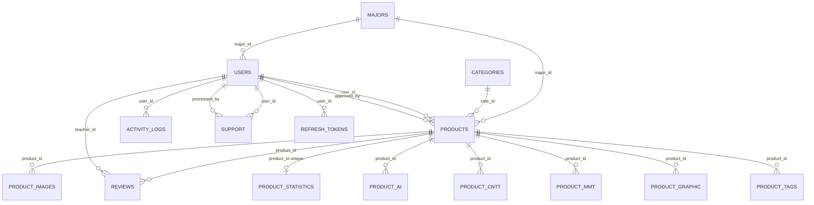

# Table relationships from Laravel migrations

Source folder: `database/migrations`

Generated date: 2026-07-03

## Legend

- `Child table.column -> Parent table.column`: foreign key direction.
- `Cascade`: deleting the parent row deletes child rows.
- `Null on delete`: deleting the parent row sets the child FK column to `null`.
- `No FK`: column exists or is indexed, but the migration does not create a database foreign key constraint.

## Primary tables and main columns

| Table | Primary key | Main columns | Relationship columns |
| --- | --- | --- | --- |
| `majors` | `major_id` | `major_name`, `major_code`, `description`, `created_at`, `updated_at` | Referenced by `users.major_id`, `products.major_id` |
| `users` | `user_id` | `name`, `email`, `phone`, `address`, `bio`, `email_verified_at`, `password`, `class`, `mssv`, `class_name`, `role`, `avatar`, `remember_token`, `created_at`, `updated_at` | `major_id` -> `majors.major_id`; referenced by `products.user_id`, `products.approved_by`, `reviews.teacher_id`, `activity_logs.user_id`, `support.user_id`, `support.processed_by`, `refresh_tokens.user_id` |
| `categories` | `cate_id` | `category_name`, `description`, `created_at`, `updated_at` | Referenced by `products.cate_id` |
| `products` | `product_id` | `title`, `description`, `team_members`, `thumbnail`, `status`, `advisor_name`, `awards`, `github_link`, `demo_link`, `submitted_at`, `approved_at`, `created_at`, `updated_at` | `user_id` -> `users.user_id`; `major_id` -> `majors.major_id`; `cate_id` -> `categories.cate_id`; `approved_by` -> `users.user_id`; referenced by product detail/image/statistic/review/tag tables |
| `product_images` | `product_image_id` | `image_url`, `created_at`, `updated_at` | `product_id` -> `products.product_id` |
| `reviews` | `review_id` | `comment`, `created_at`, `updated_at` | `product_id` -> `products.product_id`; `teacher_id` -> `users.user_id` |
| `activity_logs` | `log_id` | `action`, `description`, `created_at`, `updated_at` | `user_id` -> `users.user_id` |
| `product_statistics` | `statistic_id` | `views`, `likes`, `downloads`, `shares`, `created_at`, `updated_at` | `product_id` -> `products.product_id` and is `unique` |
| `product_ai` | `product_ai_id` | `model_used`, `framework`, `language`, `dataset_used`, `accuracy_score`, `created_at`, `updated_at` | `product_id` -> `products.product_id` |
| `product_cntt` | `product_cntt_id` | `programming_language`, `framework`, `database_used`, `created_at`, `updated_at` | `product_id` -> `products.product_id` |
| `product_mmt` | `product_mmt_id` | `network_protocol`, `topology_type`, `simulation_tool`, `config_file`, `created_at`, `updated_at` | `product_id` -> `products.product_id` |
| `product_graphic` | `product_graphic_id` | `design_type`, `tools_used`, `color_palette`, `behance_link`, `created_at`, `updated_at` | `product_id` -> `products.product_id` |
| `product_tags` | `product_tag_id` | `tag_name`, `created_at`, `updated_at` | `product_id` -> `products.product_id` |
| `support` | `support_id` | `identifier`, `name`, `email`, `phone`, `subject`, `message`, `type`, `status`, `processed_at`, `created_at`, `updated_at` | `user_id` -> `users.user_id`; `processed_by` -> `users.user_id` |
| `refresh_tokens` | `id` | `token_hash`, `expires_at`, `revoked_at`, `created_at`, `updated_at` | `user_id` -> `users.user_id` |
| `personal_access_tokens` | `id` | `tokenable_type`, `tokenable_id`, `name`, `token`, `abilities`, `last_used_at`, `expires_at`, `created_at`, `updated_at` | Polymorphic relation by `tokenable_type` + `tokenable_id`; No FK |
| `system_settings` | `id` | `key`, `value`, `created_at`, `updated_at` | None |
| `password_reset_tokens` | `email` | `token`, `created_at` | Logical email relation to `users.email`; No FK |
| `sessions` | `id` | `user_id`, `ip_address`, `user_agent`, `payload`, `last_activity` | `user_id` is indexed only; No FK |
| `cache` | `key` | `value`, `expiration` | None |
| `cache_locks` | `key` | `owner`, `expiration` | None |
| `jobs` | `id` | `queue`, `payload`, `attempts`, `reserved_at`, `available_at`, `created_at` | None |
| `job_batches` | `id` | `name`, `total_jobs`, `pending_jobs`, `failed_jobs`, `failed_job_ids`, `options`, `cancelled_at`, `created_at`, `finished_at` | None |
| `failed_jobs` | `id` | `uuid`, `connection`, `queue`, `payload`, `exception`, `failed_at` | None |

## Explicit foreign keys

| Child table | Child column | Parent table | Parent column | Nullable | Delete action | Cardinality from DB |
| --- | --- | --- | --- | --- | --- | --- |
| `users` | `major_id` | `majors` | `major_id` | Yes | Cascade | `majors` 1 - N `users` |
| `products` | `user_id` | `users` | `user_id` | No | Cascade | `users` 1 - N `products` |
| `products` | `major_id` | `majors` | `major_id` | No | Cascade | `majors` 1 - N `products` |
| `products` | `cate_id` | `categories` | `cate_id` | No | Cascade | `categories` 1 - N `products` |
| `products` | `approved_by` | `users` | `user_id` | Yes | Null on delete | `users` 1 - N approved `products` |
| `product_images` | `product_id` | `products` | `product_id` | No | Cascade | `products` 1 - N `product_images` |
| `reviews` | `product_id` | `products` | `product_id` | No | Cascade | `products` 1 - N `reviews` |
| `reviews` | `teacher_id` | `users` | `user_id` | No | Cascade | `users` 1 - N `reviews` |
| `activity_logs` | `user_id` | `users` | `user_id` | No | Cascade | `users` 1 - N `activity_logs` |
| `product_statistics` | `product_id` | `products` | `product_id` | No | Cascade | `products` 1 - 0..1 `product_statistics` because `product_id` is unique |
| `product_ai` | `product_id` | `products` | `product_id` | No | Cascade | `products` 1 - N `product_ai` |
| `product_cntt` | `product_id` | `products` | `product_id` | No | Cascade | `products` 1 - N `product_cntt` |
| `product_mmt` | `product_id` | `products` | `product_id` | No | Cascade | `products` 1 - N `product_mmt` |
| `product_graphic` | `product_id` | `products` | `product_id` | No | Cascade | `products` 1 - N `product_graphic` |
| `product_tags` | `product_id` | `products` | `product_id` | No | Cascade | `products` 1 - N `product_tags` |
| `support` | `user_id` | `users` | `user_id` | Yes | Null on delete | `users` 1 - N `support` |
| `support` | `processed_by` | `users` | `user_id` | Yes | Null on delete | `users` 1 - N processed `support` |
| `refresh_tokens` | `user_id` | `users` | `user_id` | No | Cascade | `users` 1 - N `refresh_tokens` |

## Implicit or non-constrained relationships

| Table | Column(s) | Possible target | Note |
| --- | --- | --- | --- |
| `sessions` | `user_id` | `users.user_id` | The migration creates `foreignId('user_id')->nullable()->index()` but does not call `constrained()`. It is also an unsigned big integer by Laravel default, while `users.user_id` is `string(15)`, so this is not a valid FK to `users.user_id` as written. |
| `personal_access_tokens` | `tokenable_type`, `tokenable_id` | Usually an authenticatable model such as `users` | Polymorphic relation used by Sanctum-style tokens. No FK because the parent table depends on `tokenable_type`. |
| `password_reset_tokens` | `email` | `users.email` | Logical relation through email only. No FK constraint. |
| `products` | `team_members` | Possibly users or free-form team member data | Stored as JSON. No FK constraint. |
| `support` | `identifier`, `email` | Possibly user lookup fields | Indexed/used as data fields, not FK constraints. |

## Indexes related to relationship or lookup columns

| Table | Index columns | Index name |
| --- | --- | --- |
| `products` | `status`, `major_id`, `approved_at` | `products_status_major_approved_at_idx` |
| `products` | `status`, `submitted_at` | `products_status_submitted_at_idx` |
| `products` | `user_id`, `status` | `products_user_status_idx` |
| `products` | `approved_by`, `status` | `products_approved_by_status_idx` |
| `products` | `cate_id`, `status` | `products_cate_status_idx` |
| `products` | `status`, `created_at` | `products_status_created_at_idx` |
| `products` | `status`, `major_id`, `created_at` | `products_status_major_created_idx` |
| `products` | `major_id`, `status`, `approved_at`, `created_at` | `products_major_status_approved_created_idx` |
| `products` | `user_id`, `status`, `approved_at`, `created_at` | `products_user_status_approved_created_idx` |
| `users` | `role`, `major_id` | `users_role_major_idx` |
| `users` | `major_id`, `role` | `users_major_role_idx` |
| `support` | `status`, `created_at` | Laravel auto-generated/default name |
| `support` | `type`, `status`, `created_at` | `support_type_status_created_at_idx` |
| `support` | `identifier`, `status` | `support_identifier_status_idx` |
| `support` | `email`, `status` | `support_email_status_idx` |
| `product_images` | `product_id`, `created_at` | `product_images_product_created_idx` |
| `reviews` | `teacher_id`, `product_id` | `reviews_teacher_product_idx` |
| `reviews` | `product_id`, `created_at` | `reviews_product_created_idx` |
| `product_tags` | `tag_name`, `product_id` | `product_tags_tag_product_idx` |
| `product_tags` | `product_id`, `tag_name` | `product_tags_product_tag_idx` |
| `majors` | `major_code` | `majors_major_code_idx` |
| `refresh_tokens` | `expires_at` | Laravel auto-generated/default name |
| `refresh_tokens` | `revoked_at` | Laravel auto-generated/default name |
| `personal_access_tokens` | `tokenable_type`, `tokenable_id` | Laravel auto-generated/default name |
| `personal_access_tokens` | `expires_at` | Laravel auto-generated/default name |
| `sessions` | `user_id` | Laravel auto-generated/default name |
| `sessions` | `last_activity` | Laravel auto-generated/default name |
| `cache` | `expiration` | Laravel auto-generated/default name |
| `cache_locks` | `expiration` | Laravel auto-generated/default name |
| `jobs` | `queue` | Laravel auto-generated/default name |

## Mermaid ERD

## Notes

- The detail tables `product_ai`, `product_cntt`, `product_mmt`, and `product_graphic` look like product-specific extension tables, but their `product_id` columns are not unique. The database therefore allows multiple rows per product in each of those tables.
- `product_statistics.product_id` is unique, so the database enforces at most one statistic row per product.
- `users.major_id` is nullable, but the FK uses cascade delete. If a major is deleted, matching users are deleted, not set to null.
- Laravel/system tables without application FK relationships are `cache`, `cache_locks`, `jobs`, `job_batches`, `failed_jobs`, `system_settings`, and mostly `password_reset_tokens`, `sessions`, `personal_access_tokens`.
